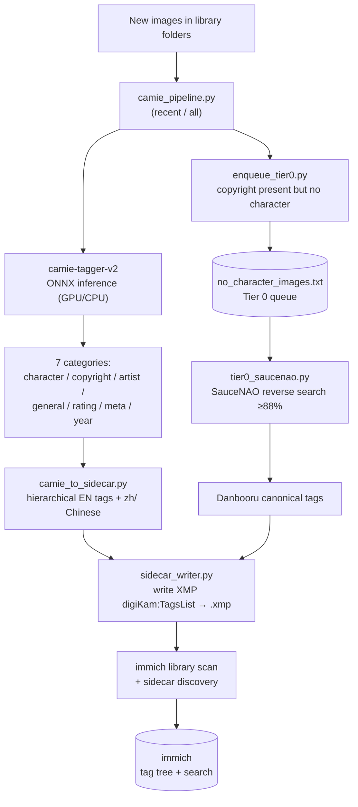

# camie-immich-tagger

**Local anime/illustration auto-tagging pipeline for [immich](https://immich.app/).**
camie-tagger-v2 (ONNX, GPU) → hierarchical XMP sidecar tags → immich browsable & searchable, with SauceNAO reverse-search backfill for characters camie can't recognize, and one-command daily automation.

本地二次元/插画自动打标流水线:camie-tagger-v2 推理 → 层级 XMP sidecar 标签 → immich 可浏览可搜索;对 camie 认不出的角色用 SauceNAO 反向搜索补漏;支持一键/每日自动增量。

  

> ⚠️ This tool tags images by content. Tag vocabulary comes from the Danbooru-style model and may include mature/NSFW descriptors. Use on your own library at your own discretion.

---

## Architecture



**Two tiers.** Tier 1 (camie) tags everything locally and fast. Tier 0 (SauceNAO→Danbooru) is an optional, rate-limited background job that fills in *specific characters* camie misses (e.g. brand-new game characters outside its training set).

---

## Features

- **Local & fast** — camie-tagger-v2 runs on your own GPU (or CPU); no images leave your machine for the main tagging path.
- **Hierarchical tags** — English tags organized as `character/`, `copyright/`, `artist/`, `general/`, `rating/`; optional Chinese under `zh/`.
- **immich-native** — writes `XMP-digiKam:TagsList` sidecars that immich reads directly; browse a tag tree and search in EN/中文.
- **Non-destructive** — tags go to `.xmp` sidecars next to images (union-merge, preserves manual tags); your original files are untouched.
- **Incremental** — a done-list makes daily runs process only genuinely new images (robust against mtime churn from batch operations).
- **Tier 0 backfill** — SauceNAO reverse search (≥88% similarity) → canonical Danbooru tags, rate-limit-aware and resumable.
- **Automation** — `update.bat` (manual one-click) and `daily.bat` (unattended Task Scheduler) chain the whole flow.

---

## Requirements

- Windows (paths/scripts assume Windows; core Python is portable with path edits)
- Python 3.11 in an isolated venv/conda env
- NVIDIA GPU + CUDA for `onnxruntime-gpu` (CPU works, slower)
- [ExifTool](https://exiftool.org/) (`exiftool.exe`)
- A running [immich](https://immich.app/) instance with **External Libraries** (mounted read-write if you want dedup/manual tagging)
- camie-tagger-v2 model (`.onnx` + `-metadata.json`) — [Camais03/camie-tagger-v2](https://huggingface.co/Camais03/camie-tagger-v2)

## Installation

```bash
git clone https://github.com/PlanetMeow/camie-immich-tagger.git
cd camie-immich-tagger
python -m venv venv_camie
venv_camie\Scripts\activate          # Windows
pip install -r requirements.txt
```

Place `exiftool.exe` and the model under your work dir (see `config.example.py`).

## Configuration

1. Copy the template and edit it:
   ```bash
   copy config.example.py config.py     # Windows
   ```
2. In `config.py` set `WORK_DIR`, `SCAN_DIRS`, `IMMICH_URL`, `LIBRARY_IDS`.
3. **Secrets go in environment variables, not the file:**
   ```bash
   setx IMMICH_API_KEY   "your-immich-api-key"
   setx SAUCENAO_API_KEY "your-saucenao-key"     # only if using Tier 0
   ```
   `config.py` is gitignored and reads keys via `os.environ`, so no plaintext key ever lands in a file.

## Usage

**Daily (only new images, seconds):**
```bash
python camie_pipeline.py recent     # tag new images + trigger immich
python enqueue_tier0.py             # queue new no-character images for Tier 0
```
or just double-click `update.bat`.

**Full re-tag (model change / first run, slow):**
```bash
python camie_pipeline.py all        # scans whole library, rebuilds done-list
```

**Tier 0 reverse search (rate-limited, run daily / scheduled):**
```bash
python tier0_saucenao.py            # consumes the queue, ~100/day on free SauceNAO
```

**Unattended:** point Windows Task Scheduler at `daily.bat` (enable *Start when available* so missed days catch up on next boot).

## Scripts

| Script | Role |
|---|---|
| `camie_pipeline.py` | Main orchestrator: scan → tag → sidecar → trigger immich (`recent`/`all`/`test`) |
| `camie_tagger.py` | camie-tagger-v2 ONNX inference core (GPU DLL injection incl.) |
| `camie_to_sidecar.py` | 7 categories → hierarchical EN tags + `zh/` Chinese |
| `sidecar_writer.py` | Write/merge `XMP-digiKam:TagsList` via ExifTool (UTF-8 safe) |
| `tag_translations.py` | Your EN→中文 general-tag dictionary (fill in) |
| `enqueue_tier0.py` | Queue "copyright but no character" images for Tier 0 |
| `tier0_saucenao.py` | SauceNAO→Danbooru backfill, rate-limited, resumable |
| `char_stats.py` | Character-coverage stats; builds the no-character list |
| `probe_danbooru.py` | Sample MD5 hit-rate probe against Danbooru |
| `probe_camie.py` | Standalone model smoke test |
| `delete_old_tags.py` | Bulk-delete old flat tags from immich (dry-run + `--confirm`) |
| `orphan_sidecar_cleanup.py` | Remove `.xmp` whose image is gone (dry-run + `--confirm`) |

## Notes & gotchas

- **immich reads tags from** `XMP-digiKam:TagsList` / `lr:HierarchicalSubject` / `IPTC:Keywords` — **not** `dc:Subject`. This tool writes `digiKam:TagsList`.
- **New sidecars** need immich's *Sidecar → Discover* job, not just metadata extraction.
- **Chinese on Windows:** all ExifTool calls go through a UTF-8 argfile; `.bat` files use ASCII-only comments to avoid GBK mojibake.
- **SauceNAO free tier** is ~100 searches/day; Tier 0 is deliberately a slow background job, not instant.
- **Tag format:** slashes inside tags are replaced with `_` to avoid accidental hierarchy.

## License & model attribution

The **code** in this repository (tagging pipeline, sidecar writer, Tier 0 scripts, etc.)
is licensed under **MIT** — see [LICENSE](LICENSE).

This tool does **not** bundle or distribute any model weights. It loads
[camie-tagger-v2](https://huggingface.co/Camais03/camie-tagger-v2) by **Camais03**,
which you download yourself from Hugging Face:

- Model `Camais03/camie-tagger-v2` — licensed under **GPL-3.0**
- Trained on the `p1atdev/danbooru-2024` dataset

The model and its license are the responsibility of its author and of the user who
downloads it — please review and comply with the model's GPL-3.0 terms. This repository's
code is independent of the model (it only calls the ONNX file at runtime) and does not
incorporate any GPL-licensed source.

---

<a name="chinese"></a>
# 中文说明

**面向 immich 的本地二次元/插画自动打标流水线。**
camie-tagger-v2(ONNX,GPU)推理 → 层级 XMP sidecar 标签 → immich 可浏览可搜索;对 camie 认不出的角色用 SauceNAO 反向搜索补漏;一键 / 每日自动增量。

> ⚠️ 本工具按内容打标,标签词表来自 Danbooru 风格模型,可能含成人/NSFW 描述词。是否在你的图库使用请自行判断。

## 工作原理(两层)

- **Tier 1(camie)**:本地 GPU 快速给全库打标,输出 7 类 → 层级英文标签 + `zh/` 中文,写进图片旁的 `.xmp` sidecar。immich 发现后即可按标签树浏览、中英文搜索。
- **Tier 0(SauceNAO→Danbooru,可选)**:对"有具体作品但 camie 没认出角色"的图,反向图搜(相似度 ≥88%)命中后回查 Danbooru 拿规范标签补上。限流慢任务,专补新角色。

## 环境要求

- Windows;Python 3.11 独立 venv/conda 环境
- NVIDIA GPU + CUDA(`onnxruntime-gpu`;CPU 也可,较慢)
- ExifTool(`exiftool.exe`)
- 运行中的 immich + External Library(要去重/手动打标则挂载为读写)
- camie-tagger-v2 模型(`.onnx` + `-metadata.json`)

## 安装与配置

1. clone 仓库,建 venv,`pip install -r requirements.txt`
2. `config.example.py` 复制为 `config.py`,填 `WORK_DIR` / `SCAN_DIRS` / `IMMICH_URL` / `LIBRARY_IDS`
3. **密钥走环境变量**,不写进文件:
   ```
   setx IMMICH_API_KEY   "你的immich key"
   setx SAUCENAO_API_KEY "你的saucenao key"
   ```
   `config.py` 已 gitignore,且用 `os.environ` 读 key,明文永不落盘。

## 日常使用

- **丢新图后**:双击 `update.bat`(= `camie_pipeline.py recent` 打标进 immich + `enqueue_tier0.py` 入队),秒级完成。
- **全量重打**(换模型/首次):`python camie_pipeline.py all`,重建已处理清单。
- **Tier 0 反向搜索**:`python tier0_saucenao.py`,免费层约 100/天,断点续跑。
- **无人值守**:Windows 计划任务指向 `daily.bat`,开启"错过后尽快运行",关机的日子开机自动补跑。

## 踩坑要点

- immich 只读 `digiKam:TagsList` / `HierarchicalSubject` / `IPTC:Keywords`,**不读 `dc:Subject`**。
- 新 sidecar 要跑 immich 的「边车 → 发现」,不只是提取元数据。
- Windows 中文:ExifTool 走 UTF-8 argfile;`.bat` 用纯 ASCII 注释,避免 GBK 乱码。
- SauceNAO 免费层 ~100/天,Tier 0 是慢任务不是即时。
- 标签内的 `/` 会被替换成 `_`,避免误建层级。

## 许可证与模型归属

本仓库**代码**(打标流水线、sidecar 写入、Tier 0 脚本等)遵循 **MIT**,见 [LICENSE](LICENSE)。

本工具**不打包、不分发任何模型权重**,运行时加载你自行从 Hugging Face 下载的
[camie-tagger-v2](https://huggingface.co/Camais03/camie-tagger-v2)(作者 **Camais03**):

- 模型 `Camais03/camie-tagger-v2` —— 遵循 **GPL-3.0**
- 训练数据集 `p1atdev/danbooru-2024`

模型及其 license 由模型作者和下载模型的用户负责,请自行遵守 GPL-3.0 条款。本仓库代码
独立于模型(仅运行时调用 ONNX 文件),不包含任何 GPL 许可的源码。
