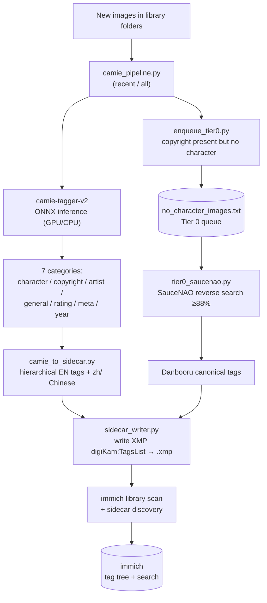
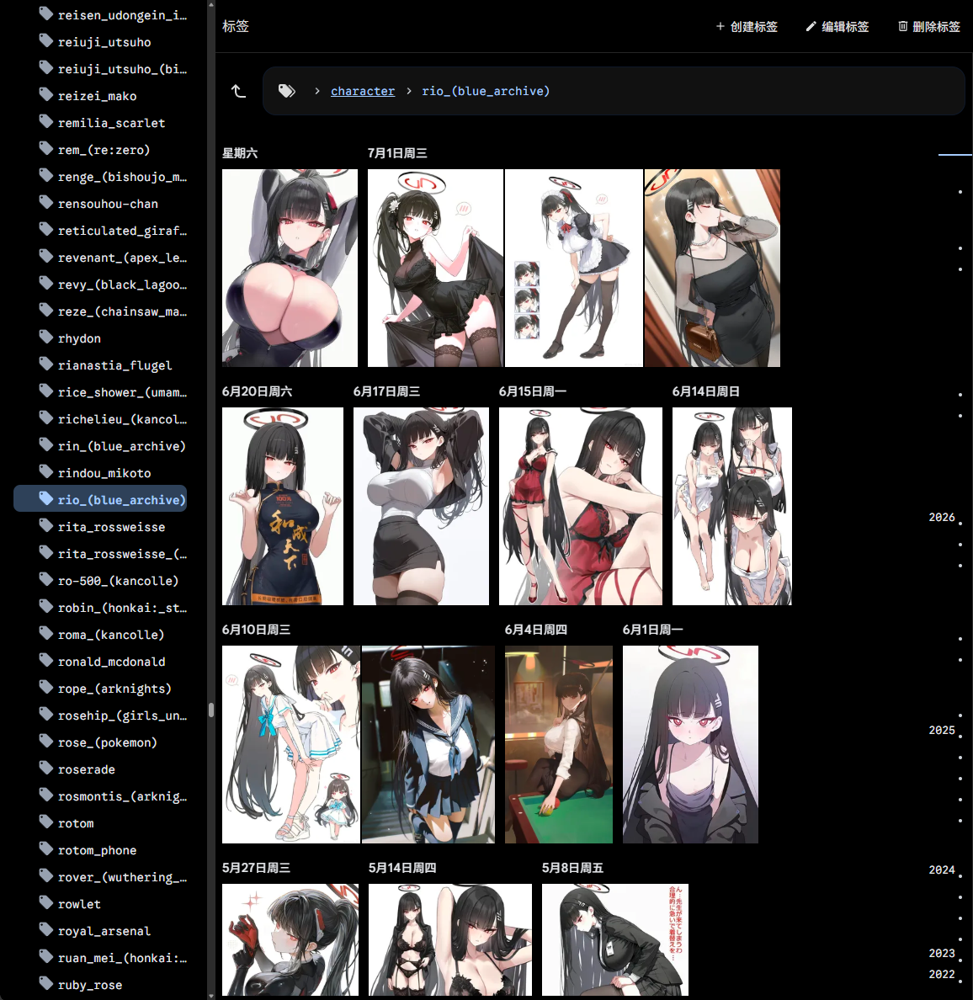
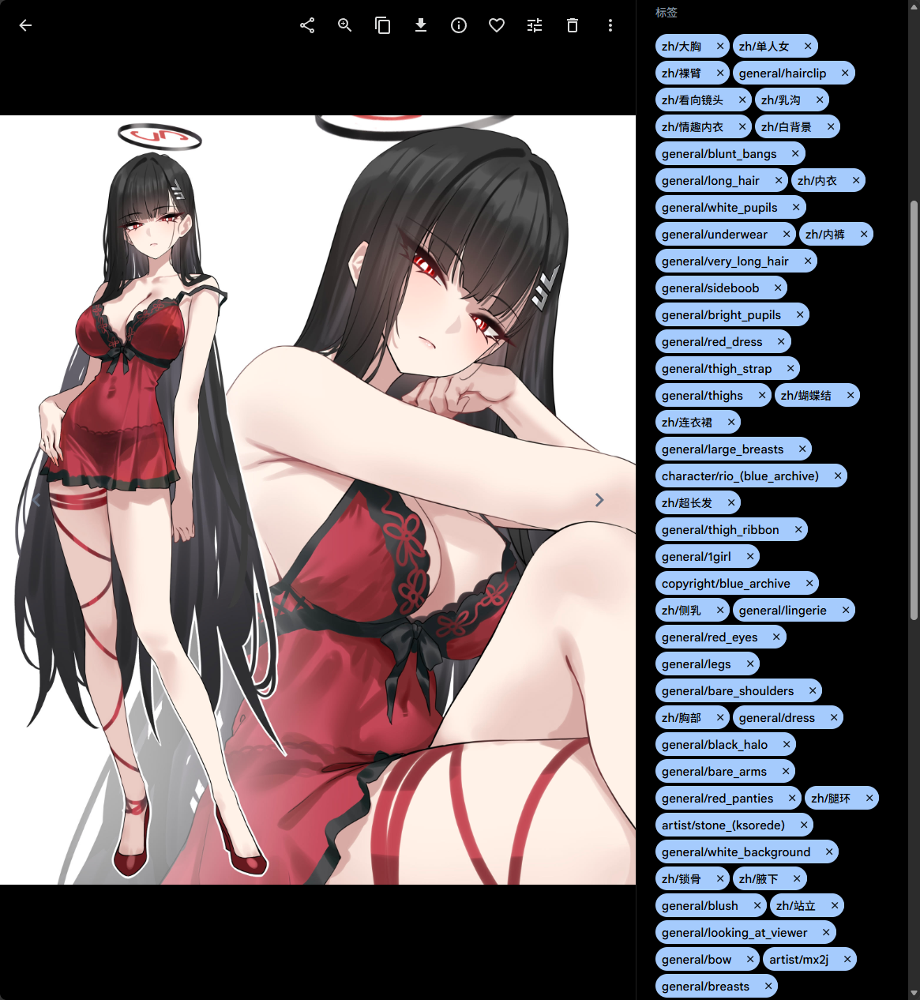
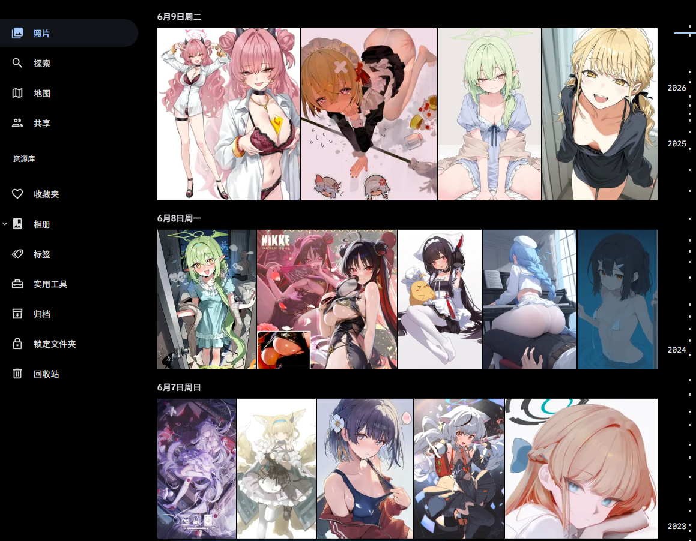

# camie-immich-tagger

**Local anime/illustration auto-tagging pipeline for [immich](https://immich.app/).**
camie-tagger-v2 (ONNX, GPU) → hierarchical XMP sidecar tags → immich browsable & searchable, with SauceNAO reverse-search backfill for characters camie can't recognize, and one-command daily automation.

**面向 [immich](https://immich.app/) 的本地二次元/插画自动打标流水线。**
camie-tagger-v2(ONNX,GPU)推理 → 层级 XMP sidecar 标签 → immich 可浏览可搜索;对 camie 认不出的角色用 SauceNAO 反向搜索补漏;支持一键 / 每日自动增量。

  

> ⚠️ This tool tags images by content. Tag vocabulary comes from the Danbooru-style model and may include mature/NSFW descriptors. Use on your own library at your own discretion.
>
> ⚠️ 本工具按内容打标,标签词表来自 Danbooru 风格模型,可能含成人/NSFW 描述词。是否在你的图库使用请自行判断。

---

## Architecture / 架构



**Two tiers.** Tier 1 (camie) tags everything locally and fast. Tier 0 (SauceNAO→Danbooru) is an optional, rate-limited background job that fills in *specific characters* camie misses (e.g. brand-new game characters outside its training set).

**两层设计。** Tier 1(camie)本地快速给全库打标。Tier 0(SauceNAO→Danbooru)是可选的限流后台任务,专门补 camie 认不出的**具体角色**(如训练集外的新游戏角色)。

---

## Screenshots / 截图

**Browse by hierarchical tag tree** — English categories (`character/`, `copyright/`, `artist/`, `general/`) plus a `zh/` branch for Chinese.
**按层级标签树浏览** —— 英文类别(`character/`、`copyright/`、`artist/`、`general/`)加上 `zh/` 中文分支。



**Every image carries its full tag set**, searchable in English or Chinese.
**每张图携带完整标签集**,中英文均可搜索。



**Your whole library, tagged and searchable in immich.**
**你的整个图库,在 immich 里打好标签、可搜索。**



---

## Features / 功能

**English**

- **Local & fast** — camie-tagger-v2 runs on your own GPU (or CPU); no images leave your machine for the main tagging path.
- **Hierarchical tags** — English tags organized as `character/`, `copyright/`, `artist/`, `general/`, `rating/`; optional Chinese under `zh/`.
- **immich-native** — writes `XMP-digiKam:TagsList` sidecars that immich reads directly; browse a tag tree and search in EN/中文.
- **Non-destructive** — tags go to `.xmp` sidecars next to images (union-merge, preserves manual tags); your original files are untouched.
- **Incremental** — a done-list makes daily runs process only genuinely new images (robust against mtime churn from batch operations).
- **Tier 0 backfill** — SauceNAO reverse search (≥88% similarity) → canonical Danbooru tags, rate-limit-aware and resumable.
- **Automation** — `update.bat` (manual one-click) and `daily.bat` (unattended Task Scheduler) chain the whole flow.

**中文**

- **本地快速** —— camie-tagger-v2 在你自己的 GPU(或 CPU)上运行,主打标流程图片不出本机。
- **层级标签** —— 英文标签按 `character/`、`copyright/`、`artist/`、`general/`、`rating/` 组织;中文可选,挂在 `zh/` 下。
- **immich 原生** —— 写 `XMP-digiKam:TagsList` sidecar,immich 直接读取;可按标签树浏览、中英文搜索。
- **非破坏性** —— 标签写进图片旁的 `.xmp` sidecar(并集合并,保留手动标签),不动原图。
- **增量** —— 已处理清单让每日运行只处理真正的新图(不受批量操作刷新 mtime 的影响)。
- **Tier 0 补漏** —— SauceNAO 反向搜索(相似度 ≥88%)→ 规范 Danbooru 标签,限流感知、断点续跑。
- **自动化** —— `update.bat`(手动一键)和 `daily.bat`(无人值守计划任务)串起整个流程。

---

## Requirements / 环境要求

**English**

- Windows (paths/scripts assume Windows; core Python is portable with path edits)
- Python 3.11 in an isolated venv/conda env
- NVIDIA GPU + CUDA for `onnxruntime-gpu` (CPU works, slower)
- [ExifTool](https://exiftool.org/) (`exiftool.exe`)
- A running [immich](https://immich.app/) instance with **External Libraries** (mounted read-write if you want dedup/manual tagging)
- camie-tagger-v2 model (`.onnx` + `-metadata.json`) — [Camais03/camie-tagger-v2](https://huggingface.co/Camais03/camie-tagger-v2)

**中文**

- Windows(路径/脚本以 Windows 为准;核心 Python 改路径后可移植)
- Python 3.11,独立 venv/conda 环境
- NVIDIA GPU + CUDA 用于 `onnxruntime-gpu`(CPU 也可,较慢)
- [ExifTool](https://exiftool.org/)(`exiftool.exe`)
- 运行中的 [immich](https://immich.app/) 实例,配 **External Library**(要去重/手动打标则挂载为读写)
- camie-tagger-v2 模型(`.onnx` + `-metadata.json`)—— [Camais03/camie-tagger-v2](https://huggingface.co/Camais03/camie-tagger-v2)

---

## Installation / 安装

Clone, create a venv, install dependencies:
克隆仓库,建 venv,安装依赖:

```bash
git clone https://github.com/PlanetMeow/camie-immich-tagger.git
cd camie-immich-tagger
python -m venv venv_camie
venv_camie\Scripts\activate          # Windows
pip install -r requirements.txt
```

Place `exiftool.exe` and the model under your work dir (see `config.example.py`).
把 `exiftool.exe` 和模型放到你的工作目录下(见 `config.example.py`)。

---

## Configuration / 配置

**English**

1. Copy the template and edit it:
   ```bash
   copy config.example.py config.py     # Windows
   ```
2. In `config.py` set `WORK_DIR`, `SCAN_DIRS`, `IMMICH_URL`, `LIBRARY_IDS`.
3. Secrets go in environment variables, not the file:
   ```bash
   setx IMMICH_API_KEY   "your-immich-api-key"
   setx SAUCENAO_API_KEY "your-saucenao-key"     # only if using Tier 0
   ```
   `config.py` is gitignored and reads keys via `os.environ`, so no plaintext key ever lands in a file.

**中文**

1. 复制模板并编辑:`copy config.example.py config.py`(Windows)。
2. 在 `config.py` 里设置 `WORK_DIR`、`SCAN_DIRS`、`IMMICH_URL`、`LIBRARY_IDS`。
3. **密钥走环境变量,不写进文件**:用上面的 `setx` 设置 `IMMICH_API_KEY` 和(如用 Tier 0)`SAUCENAO_API_KEY`。`config.py` 已 gitignore,且通过 `os.environ` 读 key,明文永不落盘。

---

## Usage / 用法

**English**

Daily (only new images, seconds):
```bash
python camie_pipeline.py recent     # tag new images + trigger immich
python enqueue_tier0.py             # queue new no-character images for Tier 0
```
or just double-click `update.bat`.

Full re-tag (model change / first run, slow):
```bash
python camie_pipeline.py all        # scans whole library, rebuilds done-list
```

Tier 0 reverse search (rate-limited, run daily / scheduled):
```bash
python tier0_saucenao.py            # consumes the queue, ~100/day on free SauceNAO
```

Unattended: point Windows Task Scheduler at `daily.bat` (enable *Start when available* so missed days catch up on next boot).

**中文**

- **日常(只处理新图,秒级)**:`python camie_pipeline.py recent`(打标 + 触发 immich)后跑 `python enqueue_tier0.py`(把新的无角色图排进 Tier 0 队列);或直接双击 `update.bat`。
- **全量重打(换模型 / 首次,较慢)**:`python camie_pipeline.py all`,扫描全库并重建已处理清单。
- **Tier 0 反向搜索(限流,每日 / 计划任务运行)**:`python tier0_saucenao.py`,消费队列,免费 SauceNAO 约 100/天。
- **无人值守**:Windows 计划任务指向 `daily.bat`,开启 *Start when available*(错过后尽快运行),关机的日子开机自动补跑。

---

## Scripts / 脚本清单

| Script / 脚本 | Role / 职责 |
|---|---|
| `camie_pipeline.py` | Main orchestrator: scan → tag → sidecar → trigger immich (`recent`/`all`/`test`) / 主编排:扫描 → 打标 → sidecar → 触发 immich |
| `camie_tagger.py` | camie-tagger-v2 ONNX inference core (GPU DLL injection incl.) / camie-v2 ONNX 推理核心(含 GPU DLL 注入) |
| `camie_to_sidecar.py` | 7 categories → hierarchical EN tags + `zh/` Chinese / 7 类 → 层级英文标签 + `zh/` 中文 |
| `sidecar_writer.py` | Write/merge `XMP-digiKam:TagsList` via ExifTool (UTF-8 safe) / 经 ExifTool 写入合并 sidecar(UTF-8 安全) |
| `tag_translations.py` | EN→中文 general-tag dictionary / general 标签的英中翻译表 |
| `enqueue_tier0.py` | Queue "copyright but no character" images for Tier 0 / 把有作品无角色的图排进 Tier 0 队列 |
| `tier0_saucenao.py` | SauceNAO→Danbooru backfill, rate-limited, resumable / SauceNAO→Danbooru 补漏,限流,断点续跑 |
| `char_stats.py` | Character-coverage stats; builds the no-character list / 角色覆盖率统计;生成无角色清单 |
| `probe_danbooru.py` | Sample MD5 hit-rate probe against Danbooru / 对 Danbooru 的 MD5 命中率抽样探针 |
| `probe_camie.py` | Standalone model smoke test / 独立的模型冒烟测试 |
| `delete_old_tags.py` | Bulk-delete old flat tags from immich (dry-run + `--confirm`) / 批量删 immich 旧平铺标签(dry-run + `--confirm`) |
| `orphan_sidecar_cleanup.py` | Remove `.xmp` whose image is gone (dry-run + `--confirm`) / 删除图片已不存在的孤儿 `.xmp`(dry-run + `--confirm`) |

---

## Notes & gotchas / 踩坑要点

**English**

- **immich reads tags from** `XMP-digiKam:TagsList` / `lr:HierarchicalSubject` / `IPTC:Keywords` — **not** `dc:Subject`. This tool writes `digiKam:TagsList`.
- **New sidecars** need immich's *Sidecar → Discover* job, not just metadata extraction.
- **Chinese on Windows:** all ExifTool calls go through a UTF-8 argfile; `.bat` files use ASCII-only comments to avoid GBK mojibake.
- **SauceNAO free tier** is ~100 searches/day; Tier 0 is deliberately a slow background job, not instant.
- **Tag format:** slashes inside tags are replaced with `_` to avoid accidental hierarchy.

**中文**

- **immich 只从** `XMP-digiKam:TagsList` / `lr:HierarchicalSubject` / `IPTC:Keywords` 读标签,**不读** `dc:Subject`。本工具写 `digiKam:TagsList`。
- **新 sidecar** 需要 immich 的「边车 → 发现(Discover)」任务,不只是提取元数据。
- **Windows 中文**:所有 ExifTool 调用走 UTF-8 argfile;`.bat` 用纯 ASCII 注释,避免 GBK 乱码。
- **SauceNAO 免费层** 约 100 次/天;Tier 0 刻意设计成慢速后台任务,不是即时。
- **标签格式**:标签内的 `/` 会被替换成 `_`,避免误建层级。

---

## License & model attribution / 许可证与模型归属

**English**

The **code** in this repository (tagging pipeline, sidecar writer, Tier 0 scripts, etc.) is licensed under **MIT** — see [LICENSE](LICENSE).

This tool does **not** bundle or distribute any model weights. It loads [camie-tagger-v2](https://huggingface.co/Camais03/camie-tagger-v2) by **Camais03**, which you download yourself from Hugging Face:

- Model `Camais03/camie-tagger-v2` — licensed under **GPL-3.0**
- Trained on the `p1atdev/danbooru-2024` dataset

The model and its license are the responsibility of its author and of the user who downloads it — please review and comply with the model's GPL-3.0 terms. This repository's code is independent of the model (it only calls the ONNX file at runtime) and does not incorporate any GPL-licensed source.

**中文**

本仓库**代码**(打标流水线、sidecar 写入、Tier 0 脚本等)遵循 **MIT**,见 [LICENSE](LICENSE)。

本工具**不打包、不分发任何模型权重**,运行时加载你自行从 Hugging Face 下载的 [camie-tagger-v2](https://huggingface.co/Camais03/camie-tagger-v2)(作者 **Camais03**):

- 模型 `Camais03/camie-tagger-v2` —— 遵循 **GPL-3.0**
- 训练数据集 `p1atdev/danbooru-2024`

模型及其 license 由模型作者和下载模型的用户负责,请自行遵守 GPL-3.0 条款。本仓库代码独立于模型(仅运行时调用 ONNX 文件),不包含任何 GPL 许可的源码。
